# Diagrama de Arquitectura - Componentes del Sistema

Este diagrama muestra la arquitectura general del sistema y las relaciones entre componentes.

```mermaid
graph TB
    subgraph "Aplicación Principal"
        Main[Main Application]
        Main --> UI[Console Interface]
        Main --> Engine[Genetic Algorithm Engine]
    end
    
    subgraph "Motor de Algoritmos Genéticos"
        Engine --> Config[Configuration Manager]
        Engine --> Pop[Population Manager]
        Engine --> Stats[Statistics Tracker]
        Engine --> Callback[Progress Callback System]
    end
    
    subgraph "Representación de Individuos"
        Pop --> Individual[Individual Class]
        Individual --> Chromosome[Binary Chromosome]
        Individual --> Decoder[Value Decoder]
        Individual --> FitnessTracker[Fitness Tracker]
    end
    
    subgraph "Jerarquía de Funciones de Fitness"
        Engine --> FitnessBase[Abstract Fitness Function]
        FitnessBase --> Linear[Linear Function]
        FitnessBase --> Quadratic[Quadratic Function]
        FitnessBase --> Sinusoidal[Sinusoidal Function]
        FitnessBase --> Rastrigin[Rastrigin Function]
        FitnessBase --> Polynomial[Polynomial Function]
        FitnessBase --> Exponential[Exponential Function]
        FitnessBase --> Cosine[Cosine Function]
    end
    
    subgraph "Operadores Genéticos"
        Engine --> Selection[Selection Operators]
        Engine --> Crossover[Crossover Operators]
        Engine --> Mutation[Mutation Operators]
        Engine --> Elitism[Elitism Manager]
        
        Selection --> Tournament[Tournament Selection]
        Selection --> Roulette[Roulette Wheel]
        Selection --> Ranking[Rank Selection]
        
        Crossover --> SinglePoint[Single Point]
        Crossover --> TwoPoint[Two Point]
        Crossover --> UniformCross[Uniform Crossover]
        
        Mutation --> BitFlip[Bit-Flip Mutation]
    end
    
    subgraph "Sistema de Interface"
        UI --> MenuSystem[Menu System]
        UI --> Display[Display Manager]
        UI --> ColorSystem[Color System]
        UI --> InputHandler[Input Handler]
        
        Display --> TableFormatter[Table Formatter]
        Display --> ProgressDisplay[Progress Display]
        Display --> ResultsDisplay[Results Display]
        
        ColorSystem --> InfoColor[Info Colors]
        ColorSystem --> SuccessColor[Success Colors]
        ColorSystem --> ErrorColor[Error Colors]
        ColorSystem --> HeaderColor[Header Colors]
    end
    
    subgraph "Configuración y Tipos"
        Config --> GAConfig[GA Configuration]
        Config --> SelectionTypes[Selection Types]
        Config --> CrossoverTypes[Crossover Types]
        Config --> TerminationCriteria[Termination Criteria]
        
        Stats --> GenerationStats[Generation Statistics]
        Stats --> ConvergenceTracker[Convergence Tracker]
        Stats --> PerformanceMetrics[Performance Metrics]
    end
    
    subgraph "Bibliotecas del Sistema"
        STL[STL Containers]
        Random[Random Generators]
        Math[Math Functions]
        IO[I/O Streams]
        Memory[Smart Pointers]
        Chrono[Timing System]
        Thread[Threading]
    end
    
    %% Dependencias con bibliotecas del sistema
    Individual --> STL
    Individual --> Math
    Engine --> Random
    Engine --> Memory
    Engine --> Chrono
    UI --> IO
    Callback --> Thread
    
    %% Flujo de datos principales
    Main -.->|User Input| UI
    UI -.->|Configuration| Engine
    Engine -.->|Progress Updates| UI
    Engine -.->|Results| Main
    
    %% Estilos
    classDef coreClass fill:#e3f2fd,stroke:#1976d2,stroke-width:3px
    classDef operatorClass fill:#e8f5e8,stroke:#388e3c,stroke-width:2px
    classDef interfaceClass fill:#fff3e0,stroke:#f57c00,stroke-width:2px
    classDef fitnessClass fill:#f3e5f5,stroke:#7b1fa2,stroke-width:2px
    classDef systemClass fill:#fafafa,stroke:#616161,stroke-width:1px
    
    class Main,Engine,Individual coreClass
    class Selection,Crossover,Mutation,Elitism,Tournament,Roulette,Ranking,SinglePoint,TwoPoint,UniformCross,BitFlip operatorClass
    class UI,MenuSystem,Display,ColorSystem,InputHandler,TableFormatter,ProgressDisplay,ResultsDisplay interfaceClass
    class FitnessBase,Linear,Quadratic,Sinusoidal,Rastrigin,Polynomial,Exponential,Cosine fitnessClass
    class STL,Random,Math,IO,Memory,Chrono,Thread systemClass
```

## Componentes Principales

### Motor Central
- **Main Application**: Punto de entrada y coordinación general
- **Genetic Algorithm Engine**: Núcleo del algoritmo evolutivo
- **Population Manager**: Gestión de poblaciones e individuos

### Representación
- **Individual Class**: Encapsulación de cromosomas y fitness
- **Binary Chromosome**: Representación binaria de soluciones
- **Value Decoder**: Conversión binario→decimal

### Operadores Evolutivos
- **Selection Operators**: Múltiples estrategias de selección
- **Crossover Operators**: Diferentes tipos de cruzamiento
- **Mutation Operators**: Operadores de mutación
- **Elitism Manager**: Preservación de mejores individuos

### Funciones de Fitness
- **Abstract Base**: Interfaz común para todas las funciones
- **Función Específicas**: Implementaciones para diferentes problemas
- **Percentage System**: Sistema de conversión a porcentajes

### Interface de Usuario
- **Console Interface**: Interacción completa con el usuario
- **Color System**: Sistema de colores para mejor visualización
- **Display Managers**: Formateo y presentación de datos

### Configuración y Estadísticas
- **Configuration Manager**: Gestión de parámetros del algoritmo
- **Statistics Tracker**: Seguimiento de métricas de evolución
- **Progress Callback**: Sistema de notificaciones de progreso

## Patrones Arquitectónicos

### Strategy Pattern
- Jerarquía de funciones de fitness
- Múltiples operadores de selección, cruzamiento y mutación

### Observer Pattern
- Sistema de callbacks para progreso
- Notificaciones de eventos del algoritmo

### Template Method
- Estructura base del algoritmo genético
- Métodos virtuales para personalización

### Factory Pattern
- Creación de funciones de fitness
- Instanciación de operadores genéticos

### RAII (Resource Acquisition Is Initialization)
- Gestión automática de memoria con smart pointers
- Liberación automática de recursos

## Flujo de Datos

### Entrada
1. **Usuario → Interface → Configuración**
2. **Configuración → Engine → Inicialización**

### Procesamiento
1. **Engine → Operadores → Poblaciones**
2. **Poblaciones → Evaluación → Estadísticas**

### Salida
1. **Estadísticas → Interface → Usuario**
2. **Resultados → Display → Visualización**