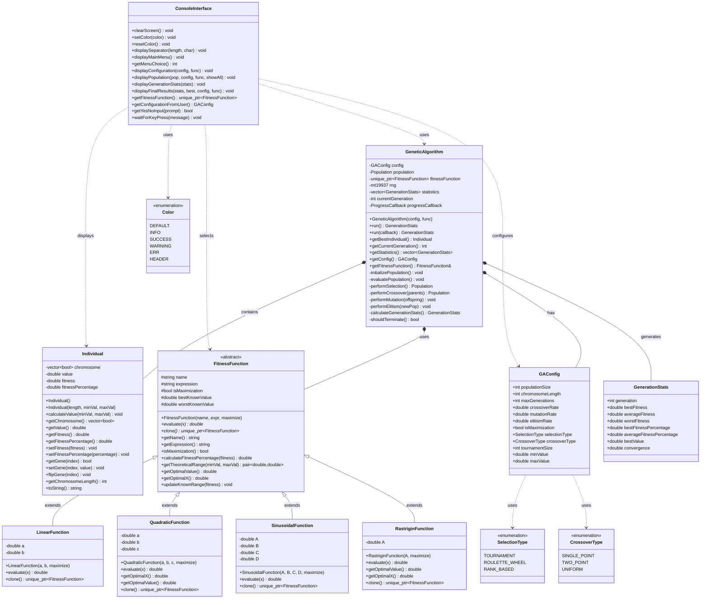

# Diagrama de Clases - Algoritmos Genéticos

Este diagrama muestra la estructura principal de clases del proyecto de algoritmos genéticos.

## Notas del Diagrama

- **GeneticAlgorithm**: Clase principal que coordina todo el proceso evolutivo
- **Individual**: Representa un individuo en la población con su cromosoma binario
- **FitnessFunction**: Jerarquía de funciones para diferentes problemas de optimización
- **ConsoleInterface**: Maneja toda la interacción con el usuario
- **GAConfig**: Estructura de configuración con todos los parámetros del algoritmo
- **GenerationStats**: Almacena estadísticas de cada generación

## Patrones de Diseño Implementados

1. **Strategy Pattern**: Jerarquía de FitnessFunction
2. **Observer Pattern**: Callback de progreso
3. **Template Method**: Estructura del algoritmo genético
4. **Factory Pattern**: Creación de funciones de fitness