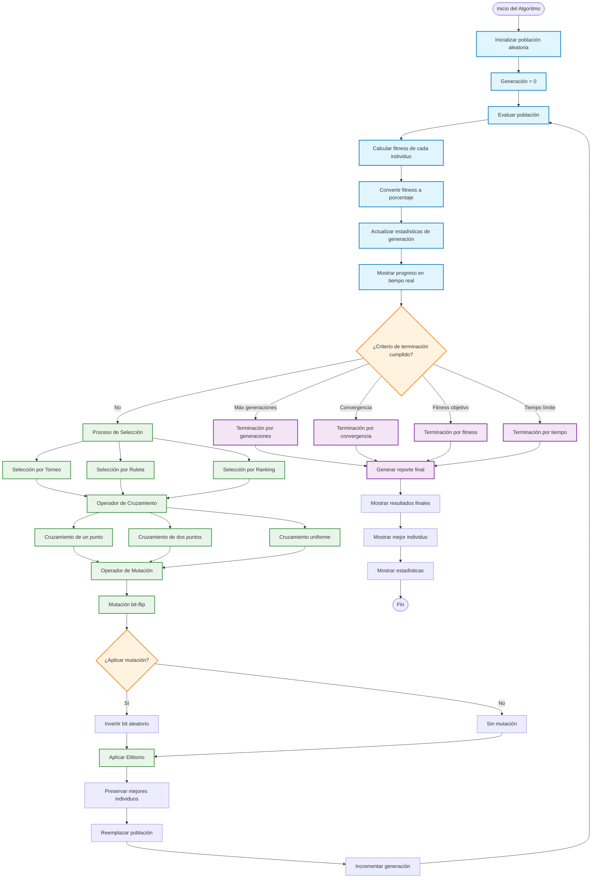

# Diagrama de Flujo - Proceso Evolutivo

Este diagrama muestra el flujo detallado del proceso evolutivo del algoritmo genético.

## Detalles del Proceso

### Inicialización
- **Población Aleatoria**: Se generan individuos con cromosomas binarios aleatorios
- **Tamaño Configurable**: El tamaño de población es definido por el usuario
- **Rango de Valores**: Los individuos representan valores en el rango [minValue, maxValue]

### Evaluación
- **Decodificación**: Conversión de binario a decimal
- **Función Objetivo**: Aplicación de la función de fitness seleccionada
- **Sistema de Porcentajes**: Conversión a escala 0-100% para mejor comprensión

### Criterios de Terminación
1. **Máximo de Generaciones**: Límite superior de iteraciones
2. **Convergencia**: Estabilización del fitness promedio
3. **Fitness Objetivo**: Alcanzar un valor específico
4. **Tiempo Límite**: Duración máxima de ejecución

### Operadores Genéticos

#### Selección
- **Torneo**: Competencia entre k individuos aleatorios
- **Ruleta**: Probabilidad proporcional al fitness
- **Ranking**: Basado en posición ordenada

#### Cruzamiento
- **Un Punto**: División en punto aleatorio
- **Dos Puntos**: División en dos puntos aleatorios
- **Uniforme**: Intercambio bit por bit

#### Mutación
- **Bit-Flip**: Inversión aleatoria de bits
- **Tasa Configurable**: Probabilidad de mutación por bit

#### Elitismo
- **Preservación**: Mantener mejores individuos
- **Porcentaje Configurable**: Fracción de elite a preservar