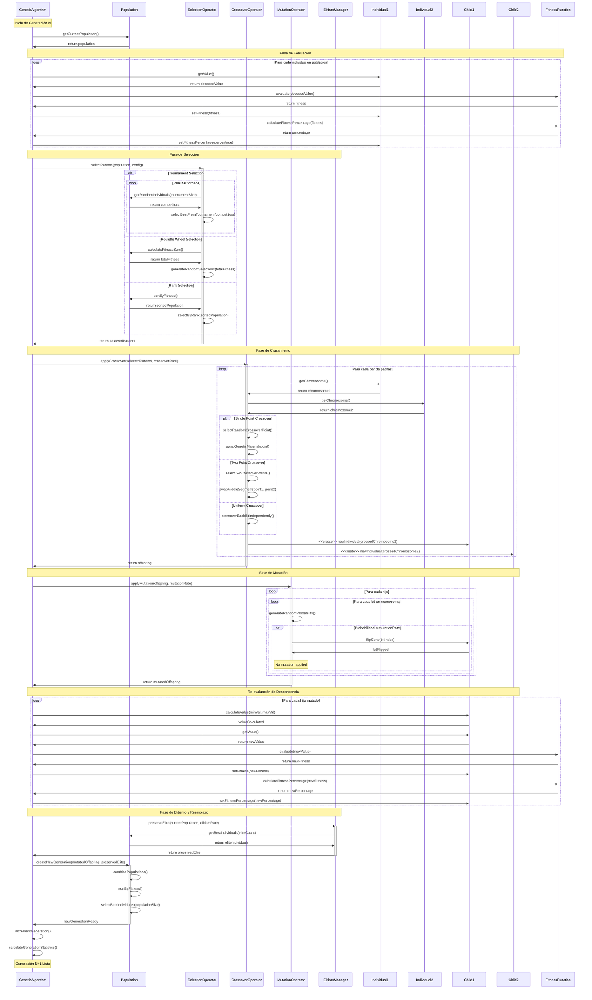

# Diagrama de Interacciones - Operadores Genéticos

Este diagrama muestra las interacciones entre componentes durante la ejecución de los operadores genéticos.

## Operadores Genéticos Detallados

### Selección
- **Tournament**: Competencia entre k individuos aleatorios
- **Roulette Wheel**: Probabilidad proporcional al fitness
- **Rank**: Selección basada en ranking ordenado

### Cruzamiento
- **Single Point**: Intercambio en un punto aleatorio
- **Two Point**: Intercambio entre dos puntos
- **Uniform**: Intercambio independiente por bit

### Mutación
- **Bit-Flip**: Inversión de bits con probabilidad configurable
- **Rate Control**: Tasa de mutación aplicada por bit

### Elitismo
- **Preservation**: Mantener mejores individuos de generación anterior
- **Elite Count**: Número basado en porcentaje de elitismo

## Flujo de Datos Clave

### Evaluación de Fitness
1. Decodificación de cromosoma a valor real
2. Aplicación de función de fitness
3. Conversión a porcentaje (0-100%)
4. Actualización de estadísticas

### Creación de Nueva Generación
1. Selección de padres basada en fitness
2. Cruzamiento para generar descendencia
3. Mutación de descendencia
4. Re-evaluación de fitness
5. Aplicación de elitismo
6. Reemplazo de población

### Control de Calidad
- Preservación de diversidad genética
- Mantenimiento de mejores soluciones
- Balance entre exploración y explotación