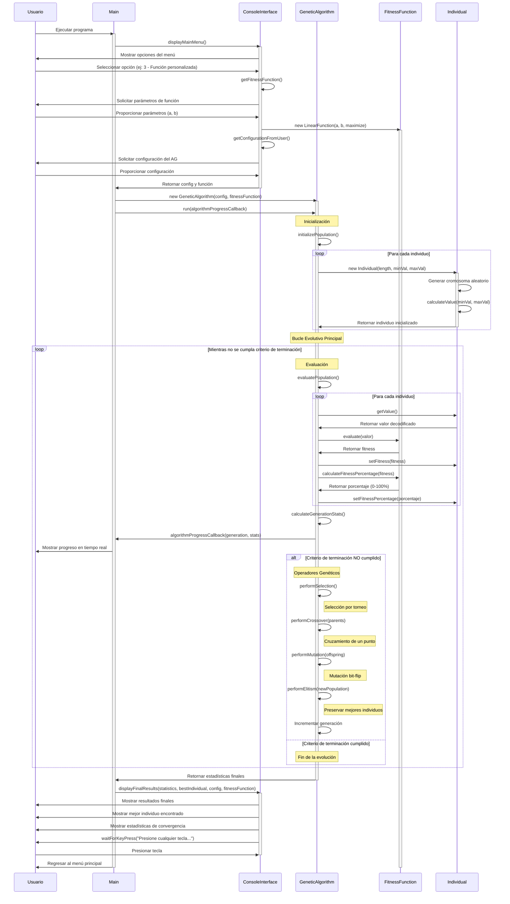

# Diagrama de Secuencia - Ejecución del Algoritmo Genético

Este diagrama muestra el flujo completo de ejecución del algoritmo genético desde la inicialización hasta la obtención de resultados.

## Aspectos Destacados del Flujo

### Inicialización
- **Población Aleatoria**: Cada individuo se crea con cromosomas binarios aleatorios
- **Decodificación**: Los cromosomas se convierten a valores reales en el rango [minValue, maxValue]

### Evaluación
- **Fitness Calculation**: Se calcula el fitness usando la función objetivo seleccionada
- **Percentage System**: El fitness se convierte a porcentaje (0-100%) para mejor comprensión

### Operadores Genéticos
1. **Selección**: Torneo, ruleta o ranking
2. **Cruzamiento**: Un punto, dos puntos o uniforme
3. **Mutación**: Bit-flip con probabilidad configurable
4. **Elitismo**: Preservación de los mejores individuos

### Criterios de Terminación
- Número máximo de generaciones alcanzado
- Convergencia del fitness
- Tiempo máximo de ejecución
- Fitness objetivo alcanzado

### Visualización en Tiempo Real
- Progreso generación por generación
- Estadísticas de fitness (mejor, promedio, peor)
- Percentajes intuitivos para el usuario
- Información de convergencia