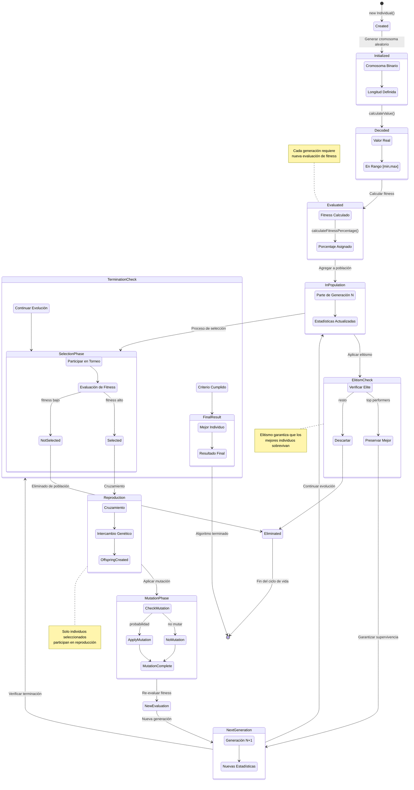

# Diagrama de Estados - Ciclo de Vida de un Individuo

Este diagrama muestra los diferentes estados por los que pasa un individuo durante el proceso evolutivo.

## Estados Principales

### Estados de Inicialización
- **Created**: Individuo recién creado en memoria
- **Initialized**: Cromosoma binario generado aleatoriamente
- **Decoded**: Valor real calculado a partir del cromosoma

### Estados de Evaluación
- **Evaluated**: Fitness calculado y porcentaje asignado
- **InPopulation**: Forma parte de la población actual

### Estados de Selección
- **SelectionPhase**: Participación en proceso de selección
- **Selected**: Elegido como padre para reproducción
- **NotSelected**: No seleccionado para reproducción

### Estados de Reproducción
- **Reproduction**: Participación en cruzamiento
- **MutationPhase**: Aplicación de operador de mutación
- **NewEvaluation**: Re-evaluación después de modificaciones

### Estados de Supervivencia
- **NextGeneration**: Pasa a la siguiente generación
- **ElitismCheck**: Verificación para preservación elite
- **Eliminated**: Eliminado de la población

### Estados de Terminación
- **FinalResult**: Individuo en resultado final
- **TerminationCheck**: Verificación de criterios de parada

## Transiciones Importantes

### Flujo Principal
1. **Creación → Inicialización → Decodificación → Evaluación**
2. **Población → Selección → Reproducción → Mutación**
3. **Nueva Evaluación → Siguiente Generación → Ciclo**

### Flujos Alternativos
- **No Seleccionado → Eliminado** (sin reproducción)
- **Elite → Preservado** (sobrevive automáticamente)
- **Criterio Terminación → Resultado Final**

### Probabilidades
- **Selección**: Basada en fitness relativo
- **Mutación**: Tasa configurable por bit
- **Supervivencia**: Elitismo + nueva población