# Diagrama de Casos de Uso - Sistema de Algoritmos Genéticos

Este diagrama muestra todos los casos de uso del sistema desde la perspectiva de diferentes tipos de usuarios.

```mermaid
graph TB
    subgraph "Actores"
        U1[👤 Usuario Básico]
        U2[🎓 Estudiante]
        U3[🔬 Investigador]
        U4[👨‍🏫 Profesor]
        U5[💻 Desarrollador]
    end
    
    subgraph "Sistema de Algoritmos Genéticos"
        subgraph "Casos de Uso Principales"
            UC1[🚀 Ejecutar Demostración Rápida]
            UC2[⚙️ Configurar Algoritmo Manualmente]
            UC3[📊 Seleccionar Función de Fitness]
            UC4[🔄 Ejecutar Evolución Completa]
            UC5[📈 Visualizar Progreso en Tiempo Real]
            UC6[📋 Analizar Resultados Finales]
        end
        
        subgraph "Casos de Uso Educativos"
            UC7[📚 Ver Explicación Teórica]
            UC8[🎯 Ejecutar Ejemplos Didácticos]
            UC9[📖 Acceder a Documentación]
            UC10[🔍 Comparar Algoritmos]
        end
        
        subgraph "Casos de Uso Avanzados"
            UC11[📊 Exportar Estadísticas]
            UC12[🔧 Ajustar Parámetros Evolutivos]
            UC13[🧪 Experimentar con Funciones Personalizadas]
            UC14[📈 Analizar Convergencia]
            UC15[⏱️ Configurar Criterios de Terminación]
        end
        
        subgraph "Casos de Uso del Sistema"
            SYS1[🎲 Generar Población Inicial]
            SYS2[⚡ Evaluar Fitness]
            SYS3[🎯 Aplicar Selección]
            SYS4[🔀 Realizar Cruzamiento]
            SYS5[🎭 Aplicar Mutación]
            SYS6[📊 Calcular Estadísticas]
            SYS7[🏁 Verificar Convergencia]
            SYS8[💾 Gestionar Memoria]
        end
    end
    
    %% Relaciones Usuario Básico
    U1 --> UC1
    U1 --> UC3
    U1 --> UC5
    U1 --> UC6
    
    %% Relaciones Estudiante
    U2 --> UC1
    U2 --> UC7
    U2 --> UC8
    U2 --> UC9
    U2 --> UC5
    U2 --> UC6
    
    %% Relaciones Investigador
    U3 --> UC2
    U3 --> UC4
    U3 --> UC11
    U3 --> UC12
    U3 --> UC13
    U3 --> UC14
    U3 --> UC15
    
    %% Relaciones Profesor
    U4 --> UC7
    U4 --> UC8
    U4 --> UC9
    U4 --> UC10
    U4 --> UC1
    
    %% Relaciones Desarrollador
    U5 --> UC13
    U5 --> UC11
    U5 --> UC12
    U5 --> UC2
    U5 --> UC14
    
    %% Relaciones Include (casos principales incluyen casos del sistema)
    UC1 -.->|include| SYS1
    UC1 -.->|include| SYS2
    UC1 -.->|include| SYS6
    
    UC4 -.->|include| SYS1
    UC4 -.->|include| SYS2
    UC4 -.->|include| SYS3
    UC4 -.->|include| SYS4
    UC4 -.->|include| SYS5
    UC4 -.->|include| SYS6
    UC4 -.->|include| SYS7
    
    UC2 -.->|include| SYS8
    UC13 -.->|include| SYS8
    
    %% Relaciones Extend (casos opcionales extienden casos base)
    UC5 -.->|extend| UC4
    UC6 -.->|extend| UC4
    UC11 -.->|extend| UC6
    UC14 -.->|extend| UC6
    
    UC9 -.->|extend| UC7
    UC10 -.->|extend| UC8
    
    %% Relaciones de Generalización
    U2 -.->|is-a| U1
    U3 -.->|is-a| U1
    U4 -.->|is-a| U1
    U5 -.->|is-a| U1
    
    %% Estilos
    classDef userClass fill:#e3f2fd,stroke:#1976d2,stroke-width:2px
    classDef basicUC fill:#e8f5e8,stroke:#388e3c,stroke-width:2px
    classDef educationalUC fill:#fff3e0,stroke:#f57c00,stroke-width:2px
    classDef advancedUC fill:#f3e5f5,stroke:#7b1fa2,stroke-width:2px
    classDef systemUC fill:#fafafa,stroke:#616161,stroke-width:1px
    
    class U1,U2,U3,U4,U5 userClass
    class UC1,UC2,UC3,UC4,UC5,UC6 basicUC
    class UC7,UC8,UC9,UC10 educationalUC
    class UC11,UC12,UC13,UC14,UC15 advancedUC
    class SYS1,SYS2,SYS3,SYS4,SYS5,SYS6,SYS7,SYS8 systemUC
```

## Descripción de Casos de Uso

### Casos de Uso Principales

#### UC1: Ejecutar Demostración Rápida
- **Actor**: Usuario Básico, Estudiante, Profesor
- **Descripción**: Ejecutar el algoritmo con configuración predeterminada
- **Precondiciones**: Sistema iniciado
- **Flujo**: Seleccionar opción 1 → Ver evolución → Obtener resultados
- **Postcondiciones**: Resultados mostrados al usuario

#### UC2: Configurar Algoritmo Manualmente
- **Actor**: Investigador, Desarrollador
- **Descripción**: Configurar todos los parámetros del algoritmo
- **Precondiciones**: Conocimiento de parámetros
- **Flujo**: Seleccionar opción 2 → Ingresar parámetros → Validar → Ejecutar
- **Postcondiciones**: Algoritmo configurado y ejecutado

#### UC3: Seleccionar Función de Fitness
- **Actor**: Todos los usuarios
- **Descripción**: Elegir función de optimización específica
- **Precondiciones**: Sistema iniciado
- **Flujo**: Ver opciones → Seleccionar función → Configurar parámetros
- **Postcondiciones**: Función configurada para uso

#### UC4: Ejecutar Evolución Completa
- **Actor**: Investigador, Desarrollador
- **Descripción**: Ejecutar proceso evolutivo completo con seguimiento
- **Precondiciones**: Configuración realizada
- **Flujo**: Iniciar → Monitorear progreso → Analizar convergencia → Obtener resultados
- **Postcondiciones**: Evolución completada con estadísticas

### Casos de Uso Educativos

#### UC7: Ver Explicación Teórica
- **Actor**: Estudiante, Profesor
- **Descripción**: Acceder a explicaciones sobre algoritmos genéticos
- **Precondiciones**: Sistema iniciado
- **Flujo**: Seleccionar opción de ayuda → Ver explicaciones → Navegar contenido
- **Postcondiciones**: Conocimiento adquirido

#### UC8: Ejecutar Ejemplos Didácticos
- **Actor**: Estudiante, Profesor
- **Descripción**: Ejecutar ejemplos predefinidos con fines educativos
- **Precondiciones**: Sistema iniciado
- **Flujo**: Seleccionar ejemplo → Ver explicación → Ejecutar → Analizar
- **Postcondiciones**: Comprensión del algoritmo mejorada

### Casos de Uso Avanzados

#### UC11: Exportar Estadísticas
- **Actor**: Investigador
- **Descripción**: Exportar datos de evolución para análisis externo
- **Precondiciones**: Ejecución completada
- **Flujo**: Completar evolución → Solicitar exportación → Guardar datos
- **Postcondiciones**: Datos guardados en formato procesable

#### UC13: Experimentar con Funciones Personalizadas
- **Actor**: Investigador, Desarrollador
- **Descripción**: Crear y probar nuevas funciones de fitness
- **Precondiciones**: Conocimiento de programación
- **Flujo**: Definir función → Implementar → Probar → Analizar resultados
- **Postcondiciones**: Nueva función integrada y probada

## Actores del Sistema

### 👤 Usuario Básico
- **Características**: Uso ocasional, configuraciones simples
- **Objetivos**: Obtener resultados rápidos y comprensibles
- **Casos principales**: Demostración rápida, visualización básica

### 🎓 Estudiante
- **Características**: Aprendizaje de algoritmos genéticos
- **Objetivos**: Comprender conceptos y ver ejemplos prácticos
- **Casos principales**: Ejemplos didácticos, explicaciones teóricas

### 🔬 Investigador
- **Características**: Uso avanzado para experimentación
- **Objetivos**: Análisis detallado y experimentación
- **Casos principales**: Configuración avanzada, análisis de convergencia

### 👨‍🏫 Profesor
- **Características**: Uso educativo en clases
- **Objetivos**: Demostrar conceptos a estudiantes
- **Casos principales**: Ejemplos didácticos, comparaciones

### 💻 Desarrollador
- **Características**: Extensión y personalización del sistema
- **Objetivos**: Implementar nuevas funcionalidades
- **Casos principales**: Funciones personalizadas, configuración avanzada

## Relaciones entre Casos de Uso

### Include (Obligatorias)
- Los casos principales incluyen obligatoriamente casos del sistema
- UC4 incluye todos los operadores genéticos
- UC1 incluye evaluación básica

### Extend (Opcionales)
- UC5 y UC6 extienden UC4 con funcionalidades adicionales
- UC11 y UC14 extienden UC6 con análisis avanzado
- UC9 extiende UC7 con documentación adicional

### Generalización
- Todos los actores especializados heredan capacidades del Usuario Básico
- Jerarquía: Usuario Básico ← Estudiante/Investigador/Profesor/Desarrollador